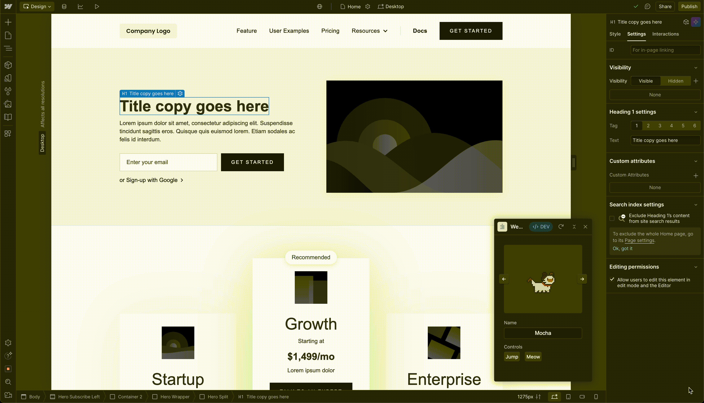
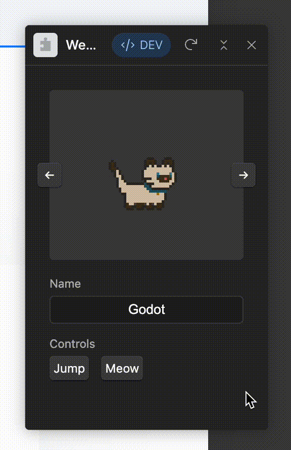

# Webflow Pets

Add more cats to your Webflow Designer experience, for fun and productivity! ₍^. .^₎⟆




Inspired by [Tamagotchi](https://en.wikipedia.org/wiki/Tamagotchi) and [vscode-pets](https://github.com/tonybaloney/vscode-pets).

Pixel cat assets by [ToffeeCraft](https://toffeecraft.itch.io/).

Check out the [documentation](https://developers.webflow.com/designer/reference/introduction) for in-depth information about Designer Extension features and API.

## Features

<table>
<tr>
<td>

</td>
<td>

* Select your favourite cat and give them a name.
* Interact with your talented cat, who can jump and speak!
* Your cat watches you work, and will react when you select new elements in the designer.

</td>
</tr>
</table>

## Requirements

Ensure your machine has the Webflow CLI available:

```
npm i @webflow/webflow-cli -g
```

## Developing

```
$ npm run dev
```

The above command does a few things:

- Installs dependencies
- Watches for changes in the `src/` folder and recompiles your TypeScript files, outputting an `index.js` file under the `public/` folder
- Spins up a process that serves your extension files from under `public/`

The command outputs the URL under which your extension is being served. Use this as the “Development URL” for your app in the Webflow Designer’s Apps panel. You can then launch the extension from the same place.

## Deploying

```
$ npm run build
```

This will take the contents of the `./public` folder and prepare a `bundle.zip` file ready for you to upload as a Designer extension for your App.

## Cat

```
⠀⠀⠀⠀⠀⠀⠀⢠⣿⣿⣦⠀⠀⠀⠀⠀⠀⠀⠀⠀⢀⣴⣿⣦⡀⠀⠀⠀⠀⠀⠀⠀
⠀⠀⠀⠀⠀⠀⢠⣿⣿⣿⣿⣆⠀⠀⠀⠀⠀⠀⠀⠀⣾⣿⣿⣿⣷⠀⠀⠀⠀⠀⠀⠀
⠀⠀⠀⠀⠀⢀⣾⣿⣿⣿⣿⣿⡆⠀⠀⠀⠀⠀⠀⣸⣿⣿⣿⣿⣿⡆⠀⠀⠀⠀⠀⠀
⠀⠀⠀⠀⠀⣾⣿⣿⣿⣿⣿⣿⣿⡀⠀⠀⠀⠀⢀⣿⣿⣿⣿⣿⣿⣿⠀⠀⠀⠀⠀⠀
⠀⠀⠀⠀⢸⣿⣿⣿⣿⣿⣿⣿⣿⣧⠀⠀⠀⠀⣼⣿⣿⣿⣿⣿⣿⣿⡇⠀⠀⠀⠀⠀
⠀⠀⠀⠀⣿⣿⣿⣿⣿⣿⣿⣿⣿⣿⣠⣤⣤⣼⣿⣿⣿⣿⣿⣿⣿⣿⣷⠀⠀⠀⠀⠀
⠀⠀⠀⢀⣿⣿⣿⣿⣿⣿⣿⣿⣿⣿⣿⣿⣿⣿⣿⣿⣿⣿⣿⣿⣿⣿⣿⠀⠀⠀⠀⠀
⠀⠀⠀⢸⣿⣿⣿⣿⣿⣿⣿⣿⣿⣿⣿⣿⣿⣿⣿⣿⣿⣿⣿⣿⣿⣿⣿⠀⠀⠀⠀⠀
⠀⠀⠀⠘⣿⣿⣿⣿⠟⠁⠀⠀⠀⠹⣿⣿⣿⣿⣿⠟⠁⠀⠀⠹⣿⣿⡿⠀⠀⠀⠀⠀
⠀⠀⠀⠀⣿⣿⣿⡇⠀⠀⠀⢼⣿⠀⢿⣿⣿⣿⣿⠀⣾⣷⠀⠀⢿⣿⣷⠀⠀⠀⠀⠀
⠀⠀⠀⢠⣿⣿⣿⣷⡀⠀⠀⠈⠋⢀⣿⣿⣿⣿⣿⡀⠙⠋⠀⢀⣾⣿⣿⠀⠀⠀⠀⠀
⢀⣀⣀⣀⣿⣿⣿⣿⣿⣶⣶⣶⣶⣿⣿⣿⣿⣾⣿⣷⣦⣤⣴⣿⣿⣿⣿⣤⠤⢤⣤⡄
⠈⠉⠉⢉⣙⣿⣿⣿⣿⣿⣿⣿⣿⣿⣿⣿⣿⣿⣿⣿⣿⣿⣿⣿⣿⣿⣇⣀⣀⣀⡀⠀
⠐⠚⠋⠉⢀⣬⡿⢿⣿⣿⣿⣿⣿⣿⣿⣿⣿⣿⣿⣿⣿⣿⣿⣿⡿⣥⣀⡀⠈⠀⠈⠛
⠀⠀⠴⠚⠉⠀⠀⠀⠉⠛⣿⣿⣿⣿⣿⣿⣿⣿⣿⣿⡿⠛⠋⠁⠀⠀⠀⠉⠛⠢⠀⠀
⠀⠀⠀⠀⠀⠀⠀⠀⠀⣸⣿⣿⣿⣿⣿⣿⣿⣿⣿⣿⡇⠀⠀⠀⠀⠀⠀⠀⠀⠀⠀⠀
⠀⠀⠀⠀⠀⠀⠀⠀⣰⣿⣿⣿⣿⣿⣿⣿⣿⣿⣿⣿⣧⠀⠀⠀⠀⠀⠀⠀⠀⠀⠀⠀
⠀⠀⠀⠀⠀⠀⠀⢠⣿⣿⣿⣿⣿⣿⣿⣿⣿⣿⣿⣿⣿⡀⠀⠀⠀⠀⠀⠀⠀⠀⠀⠀
⠀⠀⠀⠀⠀⠀⢠⣿⣿⣿⣿⣿⣿⣿⣿⣿⣿⣿⣿⣿⣿⣇⠀⠀⠀⠀⠀⠀⠀⠀⠀⠀
⠀⠀⠀⠀⠀⢠⣿⣿⣿⣿⣿⣿⣿⣿⣿⣿⣿⣿⣿⣿⣿⣿⡀⠀⠀⠀⠀⠀⠀⠀⠀⠀
⠀⠀⠀⠀⢠⣿⣿⣿⣿⣿⣿⣿⣿⣿⣿⣿⣿⣿⣿⣿⣿⣿⣧⠀⠀⠀⠀⠀⠀⠀⠀⠀
⠀⠀⠀⠀⣾⣿⣿⣿⣿⣿⣿⣿⣿⣿⣿⣿⣿⣿⣿⣿⣿⣿⣿⡄⠀⠀⠀⠀⠀⠀⠀⠀
⠀⠀⠀⢸⣿⣿⣿⣿⣿⣿⣿⣿⣿⣿⣿⣿⣿⣿⣿⣿⣿⣿⣿⡇⠀⠀⠀⠀⠀⠀⠀⠀
```